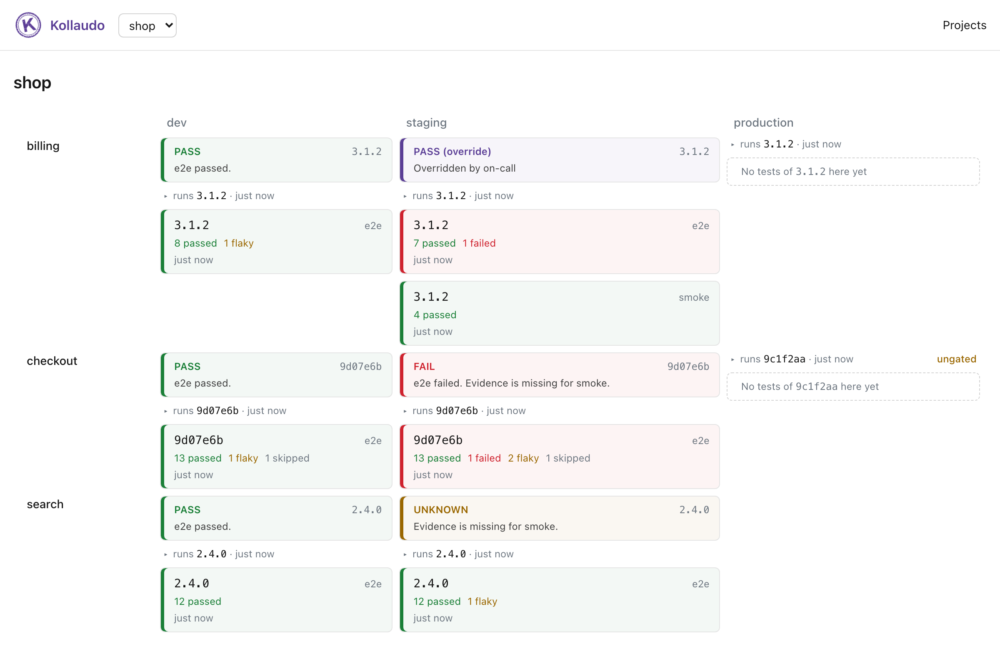
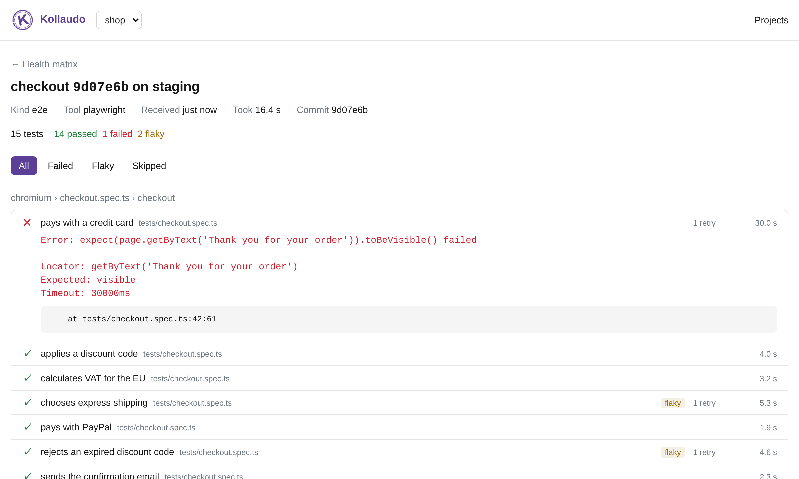

<h1 align="center">
  <picture>
    <source media="(prefers-color-scheme: dark)" srcset="docs/assets/title-dark.svg">
    
  </picture>
</h1>

<p align="center">
  <a href="https://github.com/kollaudo/kollaudo/actions/workflows/ci.yml"></a>
  <a href="https://github.com/kollaudo/kollaudo/releases/latest"></a>
  <a href="https://www.npmjs.com/package/@kollaudo/cli"></a>
  <a href="LICENSE"></a>
  <a href="https://ctrf.io"></a>
</p>

> *Collaudo* (Italian): the final acceptance test before something is put into service.

**Quality gates for every promotion, whatever builds, tests and deploys your software.**

Your CI sends test results to Kollaudo. Before a version moves on, from `dev` to `staging` or from
`staging` to `production`, your pipeline, Kargo or Argo Rollouts asks one question: *is this version
healthy here?* Kollaudo answers **pass**, **fail**, or **unknown** when tests it needs never
reported, which blocks a promotion too.

And the rules live with Kollaudo, not with the pipeline being judged: a pipeline can make a gate
stricter, never looser, and every override is recorded with who, why and until when.

<picture>
  <source media="(prefers-color-scheme: dark)" srcset="docs/assets/verdict-dark.svg">
  
</picture>

Kollaudo doesn't build, test or deploy anything: there are plenty of great tools for that. It
**collects their results and judges**, and the tool that promotes does what the verdict says.

> **v0.2 is out.** It's young: the API can still change before 1.0, and feedback is very welcome in
> [Issues](https://github.com/kollaudo/kollaudo/issues).

## Quick start

The commands use the latest release, 0.2.0, so they keep working while `main` changes.

1. Start Kollaudo, and create a project. It prints an ingest and a read token:

   ```bash
   export KOLLAUDO_VERSION=0.2.0
   curl -O https://raw.githubusercontent.com/kollaudo/kollaudo/v$KOLLAUDO_VERSION/deploy/docker-compose.yml
   docker compose up -d
   docker compose exec kollaudo kollaudo-server project create demo
   ```

2. Send an example report of e2e tests run against staging, as Playwright's CTRF reporter writes it:

   ```bash
   export KOLLAUDO_URL=http://localhost:8080
   export KOLLAUDO_TOKEN=<ingest token>
   curl -O https://raw.githubusercontent.com/kollaudo/kollaudo/v$KOLLAUDO_VERSION/docs/examples/ctrf-report.json
   npx --yes @kollaudo/cli@$KOLLAUDO_VERSION push ctrf-report.json \
     --component frontend --env staging --version 1.2.0
   ```

3. Ask whether 1.2.0 can leave staging. It can't: a test failed, so the verdict is FAIL, and the
   exit code 1.

   ```bash
   npx --yes @kollaudo/cli@$KOLLAUDO_VERSION verdict --component frontend --env staging --version 1.2.0
   ```

Then open http://localhost:8080, add the project with its **read** token, and see the health of
each component in each environment. To send your own results, see
[sending test results](docs/sending-results.md).

**On Kubernetes**, install the [Helm chart](charts/kollaudo/README.md) next to a PostgreSQL database,
such as one from CloudNativePG:

```bash
helm install kollaudo oci://ghcr.io/kollaudo/charts/kollaudo -n kollaudo \
  --set database.existingSecret=<secret with the database URI>
```

## How it fits in your delivery

```
 CI (GitHub Actions, Azure DevOps, GitLab, Jenkins…)
   build ─► deploy to dev ─► run tests ─► kollaudo push ───────────┐
                                                                    ▼
 Promotion (a pipeline step, Kargo, Argo Rollouts…)            Kollaudo
   "can 9d07e6b go from dev to staging?" ─── kollaudo verdict ─►  pass / fail / unknown
```

- **In a pipeline**, `kollaudo verdict` is one step: a non-zero exit code stops the deployment.
- **With Kargo**, the first step of a promotion asks for the verdict, so that Freight only reaches
  the next stage when it is `pass` ([Kargo recipe](docs/recipes/kargo.md)). With Argo
  Rollouts, an analysis can call `GET /v1/verdict`.
- **Kollaudo doesn't deploy**, so if it's down, deployments still work. A gate that asks for a
  verdict gets no answer (`kollaudo verdict` exits with `3`), and decides whether to stop or go
  ahead ([ADR 0002](docs/adr/0002-judge-never-orchestrate.md)). The recipes stop
  ([ADR 0019](docs/adr/0019-when-the-gate-is-skipped-or-kollaudo-is-down.md)), and
  [overrides](docs/overrides.md) let an urgent fix through.

See [sending test results](docs/sending-results.md) for any framework and CI, and the
[Playwright recipe](docs/recipes/playwright.md) for a complete example.

## Who it's for

Teams that ship several components through several environments, with tests at each step, and
want one answer before promoting a version: *can it go?*

- Your delivery is split across tools: one CI builds, another runs e2e tests, Argo CD or Flux
  deploys, Kargo or a pipeline promotes, and testers sign off somewhere else.
- You want promotion gates that don't depend on any one of them, and that you can keep when you
  change tools.
- You want a missing test run to block a release, not to go unnoticed.

If one CI system does all of this for you and its gates are enough, you probably don't need Kollaudo.

## What it does

**Today** (released in [0.2.0](CHANGELOG.md))

- **Receives test results** from any framework, as JUnit XML or [CTRF](https://ctrf.io) reports, for
  a version of a component in an environment, or at build level for unit tests.
- **Knows what runs where**: deployments sent by a pipeline step or by Argo CD after each sync.
- **Judges a version in an environment**: `pass`, `fail` or `unknown`, with the reasons, over the
  HTTP API and with `kollaudo verdict`, under [policies](docs/policies.md) kept by Kollaudo that a
  pipeline can't relax: required kinds of test, tests that count only on the deployed version,
  flaky tests, maximum age.
- **Lets urgent fixes through, on the record**: [overrides](docs/overrides.md) with who, why and
  until when.
- **Trusts evidence it can trace**: tokens with names, limited to components and environments, and
  every result recording which token sent it.
- **Shows the health of each project**: the version deployed and the latest tested version of every
  component in every environment, and the tests of each run. With the next release, the verdict of
  each cell too, and why.
- **Runs anywhere** as one container next to PostgreSQL, with Docker Compose or the
  [Helm chart](charts/kollaudo/README.md), with several projects and scoped tokens.

The web UI shows the same answers to people: the version deployed and the latest tested version of
each component in each environment, and the tests of each run.

<picture>
  <source media="(prefers-color-scheme: dark)" srcset="docs/assets/screenshots/matrix-dark.png">
  
</picture>

<picture>
  <source media="(prefers-color-scheme: dark)" srcset="docs/assets/screenshots/run-dark.png">
  
</picture>

**Next** ([roadmap](#roadmap))

- After 0.2.0: a log of the verdicts given, deployments marked when no gate asked before them, and an
  Azure DevOps recipe.
- The verdict in the UI.
- Bugs linked to failed tests, and UAT sign-offs and manual checks from the tools where testers work.
- Build signals as context: coverage, static analysis.

## What it is not

- **Not a CI system.** It doesn't build your code.
- **Not a test runner.** Your CI and your testers run the tests; Kollaudo receives the results.
- **Not a deployment or promotion tool.** It doesn't deploy or promote anything; it tells your tools whether they should.
- **Not a test management tool.** It doesn't store test cases or plan test campaigns. It records
  the results and sign-offs that come out of them.
- **Not a DORA or observability dashboard.** It decides whether a version is healthy,
  not how fast your team delivers.

For a side-by-side with tools you may already use, see [how it compares](#how-it-compares).

## How it compares

Kollaudo works with these tools rather than instead of them: Kargo promotes, Testkube runs tests,
Backstage shows them to people. Each of them does much more than this table, and most do things
Kollaudo never will. The rows are about one question: who decides, before a promotion, whether the
tests of a version are enough?

✅ yes, a main purpose · ⚠️ partly, or with extra setup · ❌ no

| | Kollaudo | Kargo | Keptn | Harness CV | Testkube | SonarQube | GitHub | Backstage |
|---|:-:|:-:|:-:|:-:|:-:|:-:|:-:|:-:|
| Gives a pass/fail verdict before a promotion | ✅ | ⚠️ | ✅ | ✅ | ⚠️ | ⚠️ | ⚠️ | ❌ |
| Treats missing evidence as its own outcome | ✅ | ❌ | ⚠️ | ⚠️ | ❌ | ❌ | ⚠️ | ❌ |
| Keeps the gate's rules outside the pipeline it judges | ✅ | ⚠️ | ⚠️ | ⚠️ | ❌ | ✅ | ✅ | ❌ |
| Records overrides, with a reason and an expiry | ✅ | ⚠️ | ❌ | ⚠️ | ❌ | ❌ | ⚠️ | ❌ |
| Takes results from any CI and test framework | ✅ | ❌ | ⚠️ | ⚠️ | ⚠️ | ⚠️ | ❌ | ⚠️ |
| Runs tests | ❌ | ⚠️ | ⚠️ | ⚠️ | ✅ | ⚠️ | ✅ | ❌ |
| Promotes or deploys | ❌ | ✅ | ⚠️ | ⚠️ | ❌ | ❌ | ✅ | ❌ |
| Judges metrics and SLOs | ❌ | ⚠️ | ✅ | ✅ | ❌ | ❌ | ❌ | ❌ |
| Open source | ✅ | ✅ | ✅ | ❌ | ⚠️ | ⚠️ | ❌ | ✅ |

When something else fits better:

- **Your gates are about metrics**, such as error rates after a canary: Keptn, Harness CV, or Kargo
  with Argo Rollouts analysis.
- **One CI system builds, tests and deploys everything**, and its required checks and environment
  rules are enough: GitHub, GitLab or Azure DevOps on their own.
- **You need tests run for you** in the cluster: Testkube. Kollaudo can judge what it runs.
- **Your gate is about code quality**, such as coverage on new code: SonarQube's quality gate.

This is our reading of each tool's documentation in October 2026, for this one question. If a cell is
wrong, please [open an issue](https://github.com/kollaudo/kollaudo/issues).

## Core concepts

Kollaudo's model is tool-agnostic. Every delivery process has these, whatever it calls them:

| Kollaudo | Examples |
|---|---|
| **Component** | a service, an app, a library you build and ship |
| **Environment** | `dev`, `staging`, `production`, a cluster, a namespace, a preview environment for a pull request |
| **Version** | whatever identifies what you test in one component: a git SHA, a pull request build, an image tag, a release candidate, a semver tag. With Kargo, a Freight can hold several images and charts: the version of a component is the tag of its own image in the Freight. It can carry its commit, branch, tag and pull request |
| **Deployment** | "version X of component Y is now running in environment Z" |
| **Test run** | results of a test session, tied to a version: on the build (unit, static analysis) or in an environment (e2e, smoke, UAT, manual) |
| **Verdict** | *pass*, *fail* or *unknown* for a version in an environment, with the reasons. *Unknown* means evidence is missing, and it never counts as a pass |
| **Policy** | the rules a verdict applies, for each component and environment, kept by Kollaudo in revisions ([policies](docs/policies.md)). Without one, the [default rules](docs/sending-results.md#what-the-verdict-checks-today) |

A **release** is simply a version you tagged and shipped: Kollaudo shows releases as a view over
versions, not as a separate concept.

## How it works

```
Any CI / script    ── kollaudo CLI  ──►┐
Anything with HTTP ── API /v1       ──►├──►  Kollaudo  ──►  verdict
CDEvents tools     ── CDEvents      ──►┘                    (UI, API, CLI)
```

- **Push-based.** Tools send data to Kollaudo. It never needs credentials to your systems.
- **Self-hosted.** One container plus PostgreSQL. Your test and deployment data stay with you.
- **API-first.** The bundled UI uses only the public API, so you can build on the same data:
  Backstage, Grafana, your own portal.

## Works with anything

Kollaudo's core knows nothing about specific tools. Everything comes in through three generic
entry points:

| Entry point | Use it from |
|---|---|
| `kollaudo` CLI | any CI or script: GitHub Actions, GitLab CI, Jenkins, Azure DevOps, bash… |
| HTTP API `/v1` | anything that can send a request |
| [CDEvents](https://cdevents.dev) | any tool that emits them: Tekton, Jenkins, Testkube… |

The verdict is just as generic: any promotion tool that can call a URL or run a command can use it
as a gate.

```bash
kollaudo verdict --component api --env staging --version 1.4.2
```

It exits with `0` for pass, `1` for fail, `2` for unknown, and `3` when there is no verdict (network,
token or usage error).

[Sending test results](docs/sending-results.md) explains the three steps for any test framework
and any CI: write a CTRF report, `kollaudo push` it, gate on `kollaudo verdict`.

Ready-made **recipes** are complete examples for popular tools.

| Recipe | Status |
|---|---|
| [Playwright with GitHub Actions](docs/recipes/playwright.md) | available |
| [pytest with GitHub Actions](docs/recipes/pytest.md) | available |
| [GitLab CI](docs/recipes/gitlab-ci.md) | available |
| [Argo CD notifications](docs/recipes/argocd.md) | available |
| [Kargo promotion gate](docs/recipes/kargo.md) | available |
| Azure DevOps | planned, after 0.2.0 |
| GitHub Action | planned |
| Backstage plugin | planned |
| Flux, Argo Rollouts, Flagger, Spinnaker… | contributions welcome |

## Roadmap

1. **Tests on deployed versions** (the core)
   - **v0.1**: CTRF ingest, CLI, verdict API and `kollaudo verdict` with the default policy,
     component × environment health view
   - **v0.2** ([scope](docs/milestones/v0.2.md)): JUnit XML, Helm chart, deployments, rules kept by
     Kollaudo and overrides, recipes for Argo CD and Kargo. Then a log of verdicts, ungated
     deployments and Azure DevOps
   - **v0.3**: the verdict in the UI
   - **v0.4**: bugs linked to failed tests, UAT sign-offs and manual check results from the tools
     where testers work
   - **v0.5**: gate recipes for more tools (GitHub Action, GitHub deployment protection), CDEvents
     in/out
2. **Build signals**: unit tests, coverage, static analysis and SARIF as version context
3. **After production**: post-deploy checks, rollbacks and incidents linked to versions
4. **Where teams already look**: a [Backstage](https://backstage.io) plugin that shows, on the page
   of each component in the catalog, its environments and the verdict of its latest versions. It
   reads `/v1/health` and `/v1/verdict`, and an annotation in `catalog-info.yaml`, such as
   `kollaudo/component: api`, links the two catalogs

## Design decisions

Architecture decisions are recorded in [`docs/adr/`](docs/adr/README.md). The scope of each
milestone is in [`docs/milestones/`](docs/milestones/).

## Development

Requires Node.js 24 and Docker. The repository is a pnpm monorepo
(see [ADR 0011](docs/adr/0011-typescript-monorepo.md)).

```bash
corepack enable
pnpm install
docker compose up -d
cp apps/server/.env.example apps/server/.env
pnpm admin project create demo
pnpm dev
```

`corepack enable` provides the pinned pnpm version, `docker compose up -d` starts PostgreSQL for
local development, `pnpm admin project create demo` prints an ingest and a read token, and `pnpm dev`
serves the API on :8080 and the UI, with hot reload, on :5173. CI runs:

```bash
pnpm check && pnpm typecheck && pnpm test
```

The end-to-end test runs Kollaudo in its container and uses it as a team would, with the CLI and
Playwright:

```bash
pnpm build
pnpm --filter @kollaudo/e2e exec playwright install chromium
docker compose --profile app up -d --build --wait
e2e/run.sh
```

`pnpm build` also builds the UI, which the server then serves on :8080 as in production.
`docker compose --profile app up -d --build` builds the container image from the sources and runs it
on :8080, with the same database.

Tests that need a database create a temporary one on the local PostgreSQL, or on
`TEST_DATABASE_URL`, and drop it when they finish.

After changing `apps/server/src/db/schema.ts`, generate a migration with
`pnpm --filter @kollaudo/server db:generate`.

## Contributing

The project is at a very early stage. Ideas, use cases and feedback are welcome in
[Issues](https://github.com/kollaudo/kollaudo/issues). See the
[contributing guide](CONTRIBUTING.md) before opening a
pull request, and the [security policy](https://github.com/kollaudo/.github/blob/main/SECURITY.md) to
report a vulnerability.

### Contributors

Thanks to everyone who has made Kollaudo better!

<a href="https://github.com/kollaudo/kollaudo/graphs/contributors">
  
</a>

## License

[Apache-2.0](LICENSE)
